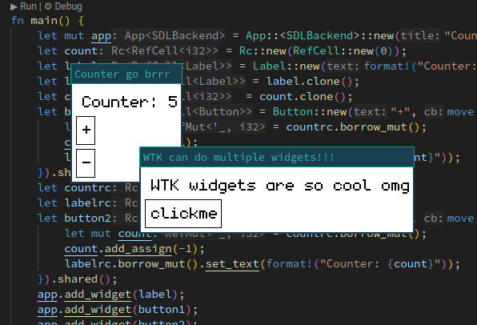

= Rust Widget Tool Kit

Wtk is a widget toolkit for rust. The goal is to create a platform agnostic toolkit that can later be used for my own linux userland https://github.com/LevitatingBusinessMan/azathos[Azathos]. However, currently SDL3 is supported as a backend.

Wtk is developed with three primary goals:

* Keep the API extremely simple
* Provide a C interface for use in language bindings (Ruby/Python etc)
* Be backend agnostic (ready to go baremetal even)



== Examples

```RUST
use wtk;
use wtk::prelude::*;

fn main() {
    let mut app = App::<SDLBackend>::new("WTK button example");
    let button = Button::new("clickme", |b| {
        b.set_text("clicked");
    }).shared();
    app.add_widget(button.clone());
    app.run();
}
```

```C
#include <libwtk.h>

void on_click(wtk_button_t button) {
    wtk_button_set_text("clicked", button);
}

int main(void) {
    wtk_app_t app = wtk_app_sdl_new("WTK button example");
    wtk_button_t button = wtk_button_new("clickme", on_click);
    wtk_app_sdl_add_widget(app, wtk_button_share(button));
    wtk_app_run(app);
    wtk_app_sdl_destroy(app);
}
```
